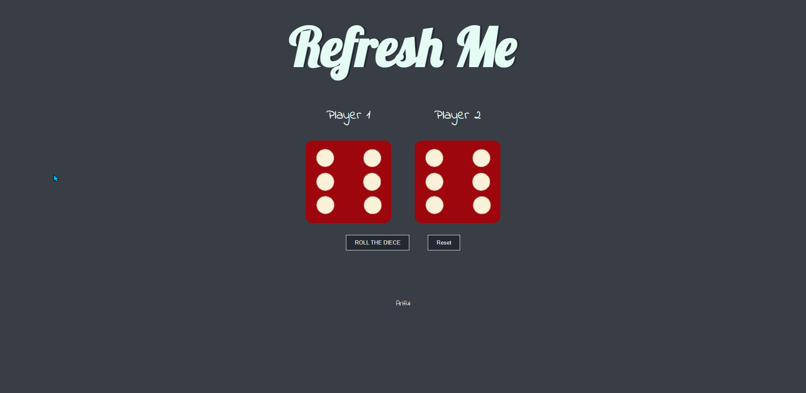

# small-projects

## [2 player Dice Roll](/smallProjects/2%20Player%20Diece%20Roll "Go to Source Code")
Used Angela Yu's starter template and complete the project in vanilla js.

## [Drum Kit](smallProjects/Drum%20Kit "Go to Source Code")
Used Angela Yu's starter template and complete the project in vanilla js.
## [Color Flipper](/smallProjects/colorFlipper "Go to Source Code")
Create a app that generate a rgb value also change the background color according to that rgb value.
## [Dad Joke Generator](/smallProjects/DadJokesGenerator "Go to Source Code")
Create a app in vanilla js that generate a dad joke. Also used axios library for fetching the data from api.
## [Ping Pong Score Keeper](/smallProjects/PingPongScoreKeeper "Go to Source Code")
Create a app in vanilla js that keep the score of a pink pong match. Used **bulma** css framework in front end.
## [Quote Generator](/smallProjects/Quote%20Generator "Go to Source Code")
 This is a single page app that generate a quote from the internet and shows it to the viewer. If you like a quote you can also share quotes directly to twitter. Used axios library for fetching api. 
## [ReviewSlider]()